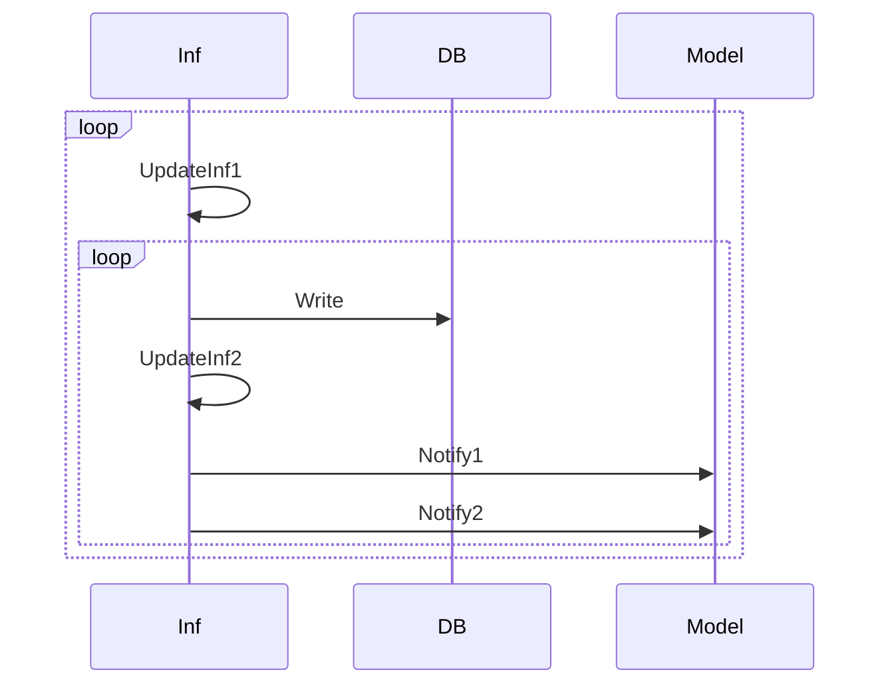
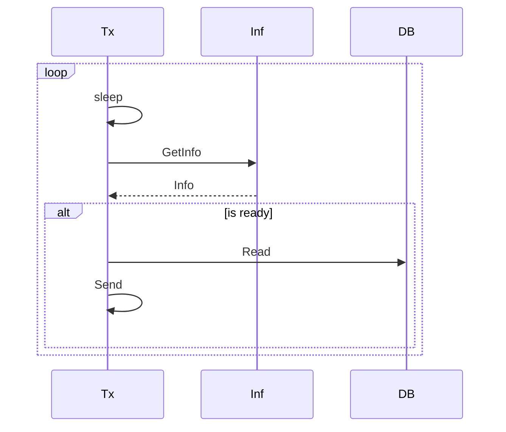
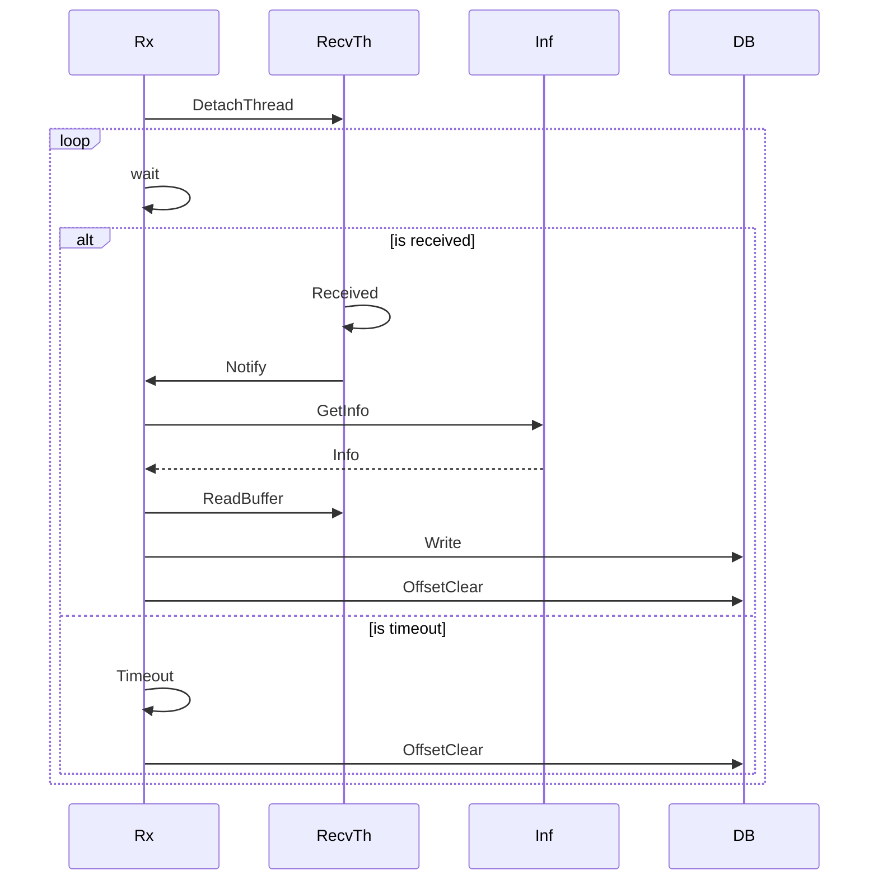

```mermaid
sequenceDiagram
    loop
    Inf ->> Inf: UpdateInf1
    loop
    Inf ->> DB: Write
    Inf ->> Inf: UpdateInf2
    Inf ->> Model: Notify1
    Inf ->> Model: Notify2
    end
    end
```

```mermaid
sequenceDiagram
    loop
    Tx ->> Tx: sleep
    Tx ->> Inf: GetInfo
    Inf -->> Tx:  Info
    alt is ready
    Tx ->> DB: Read
    Tx ->> Tx: Send
    end
    end
```

```mermaid
sequenceDiagram
    Rx ->> RecvTh: DetachThread
    loop
    Rx ->> Rx: wait
    alt is received
    RecvTh ->> RecvTh: Received
    RecvTh ->> Rx: Notify
    Rx ->> Inf: GetInfo
    Inf -->> Rx:  Info
    Rx ->> RecvTh: ReadBuffer
    Rx ->> DB: Write
    Rx ->> DB: OffsetClear
    else is timeout
    Rx ->> Rx: Timeout
    Rx ->> DB: OffsetClear
    end
    end
```

