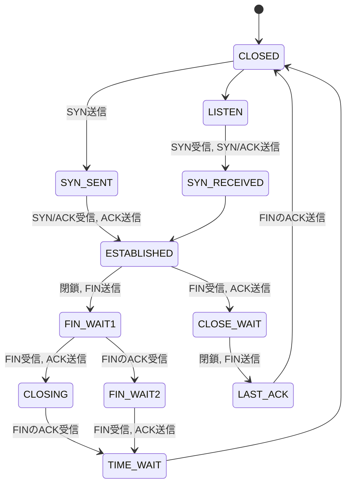

# MermaidSample

# StateDiagram

```mermaid
stateDiagram
    [*] --> CLOSED
    CLOSED --> LISTEN
    LISTEN --> SYN_RECEIVED: SYN受信, SYN/ACK送信
    CLOSED --> SYN_SENT: SYN送信
    SYN_SENT --> ESTABLISHED: SYN/ACK受信, ACK送信
    SYN_RECEIVED --> ESTABLISHED
    ESTABLISHED --> FIN_WAIT1: 閉鎖, FIN送信
    FIN_WAIT1 --> FIN_WAIT2: FINのACK受信
    FIN_WAIT1 --> CLOSING: FIN受信, ACK送信
    CLOSING --> TIME_WAIT: FINのACK受信
    FIN_WAIT2 --> TIME_WAIT: FIN受信, ACK送信
    TIME_WAIT --> CLOSED
    ESTABLISHED --> CLOSE_WAIT: FIN受信, ACK送信
    CLOSE_WAIT --> LAST_ACK: 閉鎖, FIN送信
    LAST_ACK --> CLOSED: FINのACK送信
```

[TCPの状態遷移 - Qiita](https://qiita.com/mogulla3/items/196124b9fb36578e5c80)

# Sequence
